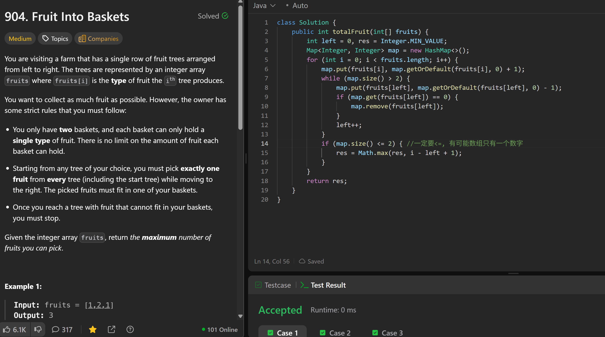

# 904. Fruit Into Baskets

**刷题日期**: 2026-02-27

**难度**: Medium

**标签**: Array, Hash Table, Sliding Window

## 题目截图



## 解题心得

一定要 `<=`，有可能数组只有一个数字（即只有一种水果类型），此时 map.size() 为 1，也需要更新结果。

## 代码

```java
class Solution {
    public int totalFruit(int[] fruits) {
        int left = 0, res = Integer.MIN_VALUE;
        Map<Integer, Integer> map = new HashMap<>();
        for (int i = 0; i < fruits.length; i++) {
            map.put(fruits[i], map.getOrDefault(fruits[i], 0) + 1);
            while (map.size() > 2) {
                map.put(fruits[left], map.getOrDefault(fruits[left], 0) - 1);
                if (map.get(fruits[left]) == 0) {
                    map.remove(fruits[left]);
                }
                left++;
            }
            if (map.size() <= 2) { //一定要<=，有可能数组只有一个数字
                res = Math.max(res, i - left + 1);
            }
        }
        return res;
    }
}
```

## 复杂度分析

- **时间复杂度**: O(n) - n 是数组长度，左右指针各最多遍历数组一次
- **空间复杂度**: O(1) - HashMap 中最多存储 3 个键值对（常数空间）
