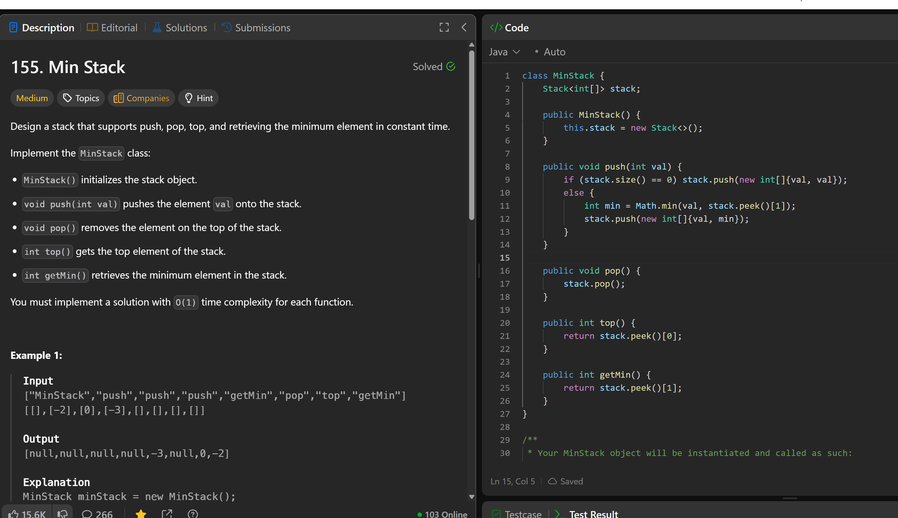

# 155. Min Stack

**刷题日期**: 2025-11-20

**难度**: Medium

**标签**: Stack, Design

## 题目截图



## 解题思路

使用一个栈存储 `int[]` 数组，每个数组包含两个值：`{当前最小值, 当前元素值}`。这样在 push 时记录当前的最小值，getMin 时直接返回栈顶数组的第一个元素即可。

## 代码

```java
class MinStack {
    Stack<int[]> stack;

    public MinStack() {
        this.stack = new Stack<>();
    }

    public void push(int val) {
        if (stack.size() == 0) stack.push(new int[]{val, val});
        else {
            int[] top = stack.peek();
            int min = Math.min(val, top[0]);
            stack.push(new int[] {min, val});
        }
    }

    public void pop() {
        stack.pop();
    }

    public int top() {
        return stack.peek()[1];
    }

    public int getMin() {
        return stack.peek()[0];
    }
}
```

## 复杂度分析

- **时间复杂度**: O(1) - 所有操作（push, pop, top, getMin）都是常数时间
- **空间复杂度**: O(n) - n 是栈中元素的数量，每个元素存储一个长度为 2 的数组
