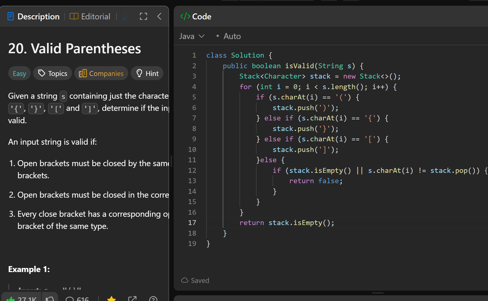

# 20. Valid Parentheses

**刷题日期**: 2025-12-05

**难度**: Easy

**标签**: Stack, String

## 题目截图



## 代码

```java
class Solution {
    public boolean isValid(String s) {
        Stack<Character> stack = new Stack<>();
        for (int i = 0; i < s.length(); i++) {
            if (s.charAt(i) == '(') {
                stack.push(')');
            } else if (s.charAt(i) == '{') {
                stack.push('}');
            } else if (s.charAt(i) == '[') {
                stack.push(']');
            } else {
                if (stack.isEmpty() || s.charAt(i) != stack.pop()) {
                    return false;
                }
            }
        }
        return stack.isEmpty();
    }
}
```

## 复杂度分析

- **时间复杂度**: O(n) - n 是字符串的长度，需要遍历整个字符串一次
- **空间复杂度**: O(n) - 最坏情况下栈中存储 n/2 个字符（全是左括号）

---
