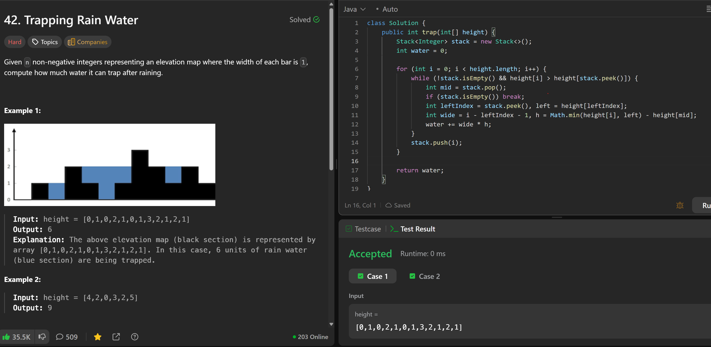

# 42. Trapping Rain Water

**刷题日期**: 2025-12-06, 2026-02-22

**复习次数**: 2

**难度**: Hard

**标签**: Array, Two Pointers, Stack, Monotonic Stack

## 题目截图



## 解题心得

- 单调递增栈，这样才能知道左边第一个墙是什么
- 先加一个不然就会对空栈操作，我们从 i=1 开始
- 分情况讨论，如果当前 num 比栈顶小，就推进去
- 检查一下栈为不为空

## 代码

```java
class Solution {
    public int trap(int[] height) {
        Stack<Integer> stack = new Stack<>();
        // 单调递增栈，这样才能知道左边第一个墙是什么
        int totalWater = 0;
        stack.push(0);
        // 先加一个不然就会对空栈操作，我们从i=1开始
        for (int i = 1; i < height.length; i++) {
            // 分情况讨论，如果当前num比栈顶小，就推进去
            while (!stack.isEmpty() && height[i] > height[stack.peek()]) {
                int mid = stack.pop();
                // 检查一下栈为不为空
                if (!stack.isEmpty()) {
                    int h = Math.min(height[i], height[stack.peek()]);
                    int w = i - stack.peek() - 1;
                    totalWater += (h - height[mid]) * w;
                }
            }
            stack.push(i);
        }
        return totalWater;
    }
}
```

## 复杂度分析

- **时间复杂度**: O(n) - 每个元素最多入栈出栈一次
- **空间复杂度**: O(n) - 栈最多存储 n 个元素

---
