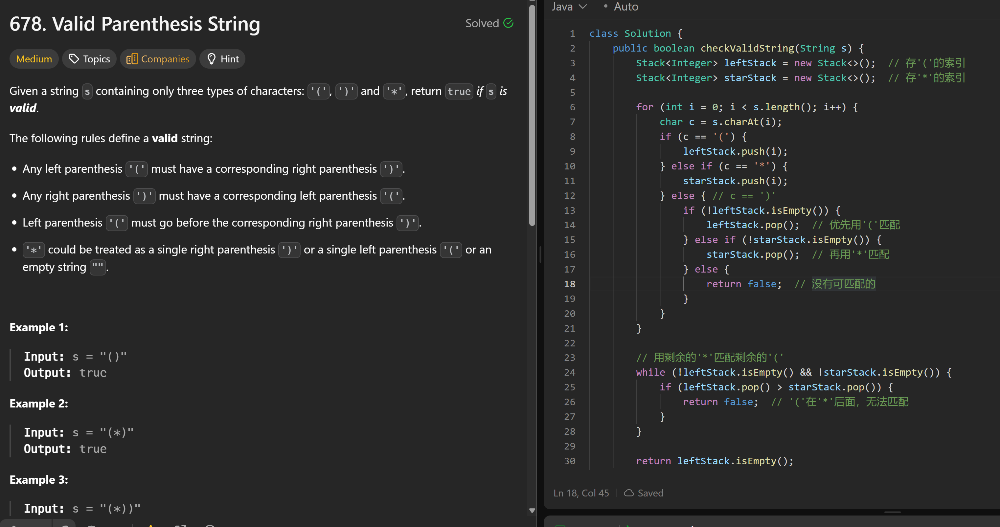

# 678. Valid Parenthesis String

**刷题日期**: 2025-11-28

**难度**: Medium

**标签**: Stack, String, Greedy

## 题目截图



## 解题心得

- **难点是存下标**：使用两个栈分别存储 `(` 和 `*` 的**下标索引**，而不是字符本身
- 遍历字符串时，遇到 `)` 优先用 `(` 匹配，没有 `(` 再用 `*` 匹配，两个栈都空则返回 false
- 第一遍 while 循环完后，还要处理 open 栈里剩余的 `(`，看能不能用 `*` 来 close
- **关键点**：`(` 的下标必须在 `*` 的下标之前才能匹配成功，因为 `*` 只能当作 `)` 来关闭它前面的 `(`
- 也可以不用双栈，用两个 counter（`minOpen` 和 `maxOpen`）来记录未匹配左括号的可能范围

## 代码

```java
class Solution {
    public boolean checkValidString(String s) {
        Stack<Integer> leftStack = new Stack<>();  // 存'('的索引
        Stack<Integer> starStack = new Stack<>();  // 存'*'的索引

        for (int i = 0; i < s.length(); i++) {
            char c = s.charAt(i);
            if (c == '(') {
                leftStack.push(i);
            } else if (c == '*') {
                starStack.push(i);
            } else { // c == ')'
                if (!leftStack.isEmpty()) {
                    leftStack.pop();  // 优先用'('匹配
                } else if (!starStack.isEmpty()) {
                    starStack.pop();  // 再用'*'匹配
                } else {
                    return false;  // 没有可匹配的
                }
            }
        }

        // 用剩余的'*'匹配剩余的'('
        while (!leftStack.isEmpty() && !starStack.isEmpty()) {
            if (leftStack.pop() > starStack.pop()) {
                return false;  // '('在'*'后面，无法匹配
            }
        }

        return leftStack.isEmpty();
    }
}
```

## 复杂度分析

- **时间复杂度**: O(n) - 遍历字符串一次
- **空间复杂度**: O(n) - 两个栈最坏情况下存储所有字符的索引

---
