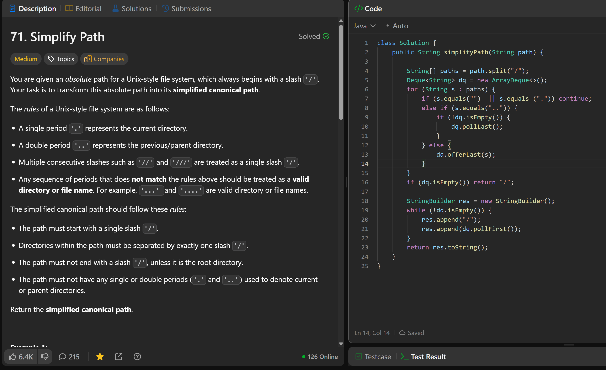

# 71. Simplify Path

**刷题日期**: 2025-11-28

**难度**: Medium

**标签**: Stack, String

## 题目截图



## 代码

```java
class Solution {
    public String simplifyPath(String path) {
        String[] paths = path.split("/");
        Deque<String> dq = new ArrayDeque<>();
        for (String s : paths) {
            if (s.equals("") || s.equals(".")) continue;
            else if (s.equals("..")) {
                if (!dq.isEmpty()) {
                    dq.pollLast();
                }
            } else {
                dq.offerLast(s);
            }
        }
        if (dq.isEmpty()) return "/";

        StringBuilder res = new StringBuilder();
        while (!dq.isEmpty()) {
            res.append("/");
            res.append(dq.pollFirst());
        }
        return res.toString();
    }
}
```

## 复杂度分析

- **时间复杂度**: O(n) - n 是路径字符串的长度，需要遍历整个路径
- **空间复杂度**: O(n) - 使用 deque 存储路径中的目录名

---
