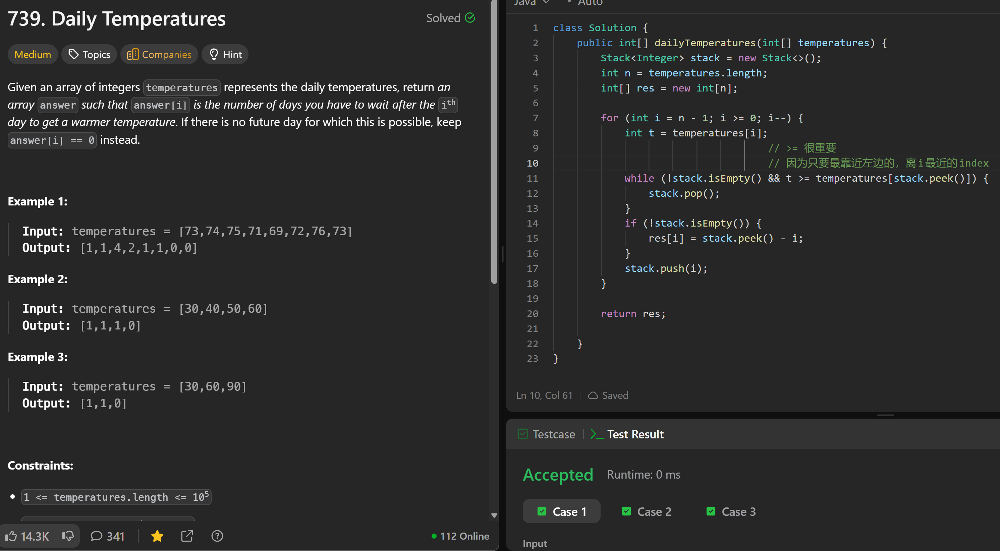

# 739. Daily Temperatures

**刷题日期**: 2025-12-06

**难度**: Medium

**标签**: Array, Stack, Monotonic Stack

## 题目截图



## 解题心得

- `>=` 很重要
- 因为只要最靠近左边的，离 i 最近的 index

## 代码

```java
class Solution {
    public int[] dailyTemperatures(int[] temperatures) {
        Stack<Integer> stack = new Stack<>();
        int n = temperatures.length;
        int[] res = new int[n];

        for (int i = n - 1; i >= 0; i--) {
            int t = temperatures[i];
            // >= 很重要
            // 因为只要最靠近左边的，离 i 最近的 index
            while (!stack.isEmpty() && t >= temperatures[stack.peek()]) {
                stack.pop();
            }
            if (!stack.isEmpty()) {
                res[i] = stack.peek() - i;
            }
            stack.push(i);
        }

        return res;
    }
}
```

## 复杂度分析

- **时间复杂度**: O(n) - 每个元素最多入栈出栈一次
- **空间复杂度**: O(n) - 栈最多存储 n 个元素

---
