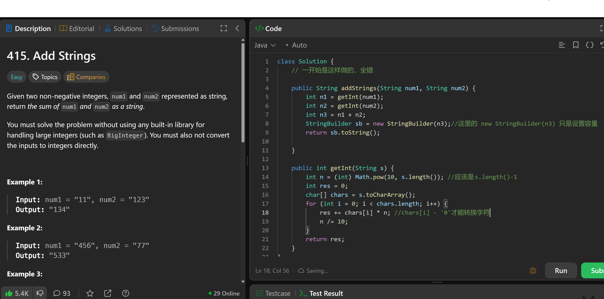
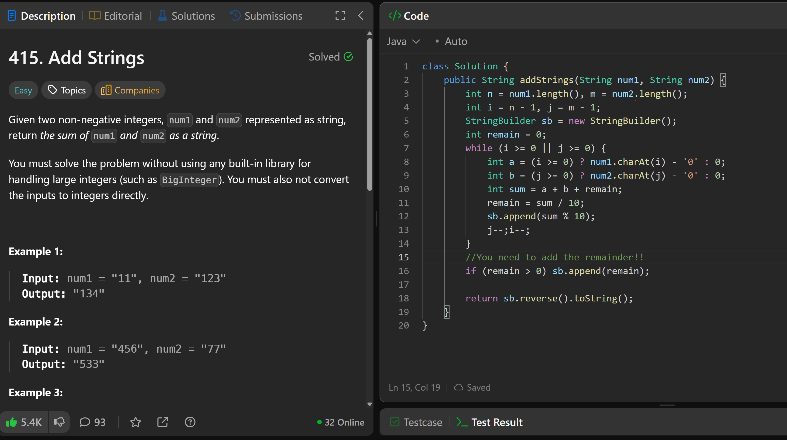

# 415. Add Strings

**刷题日期**: 2025-11-21

**难度**: Easy

**标签**: Math, String, Simulation

## 题目截图





## 解题心得

一开始想直接转换成整数相加，但这样做是错的：
1. 题目要求不能使用 BigInteger 等内置库处理大整数
2. 也不能直接把字符串转换成整数（数字可能超出 int/long 范围）

正确做法是模拟竖式加法，从右到左逐位相加，处理进位。注意最后要检查是否还有剩余的进位需要加上！

## 代码

```java
class Solution {
    public String addStrings(String num1, String num2) {
        int n = num1.length(), m = num2.length();
        int i = n - 1, j = m - 1;
        StringBuilder sb = new StringBuilder();
        int remain = 0;

        while (i >= 0 || j >= 0) {
            int a = (i >= 0) ? num1.charAt(i) - '0' : 0;
            int b = (j >= 0) ? num2.charAt(j) - '0' : 0;
            int sum = a + b + remain;
            remain = sum / 10;
            sb.append(sum % 10);
            j--;
            i--;
        }

        // You need to add the remainder!!
        if (remain > 0) sb.append(remain);

        return sb.reverse().toString();
    }
}
```

## 复杂度分析

- **时间复杂度**: O(max(n, m)) - n 和 m 分别是两个字符串的长度，需要遍历较长的那个
- **空间复杂度**: O(max(n, m)) - StringBuilder 存储结果，最多 max(n, m) + 1 位

---
