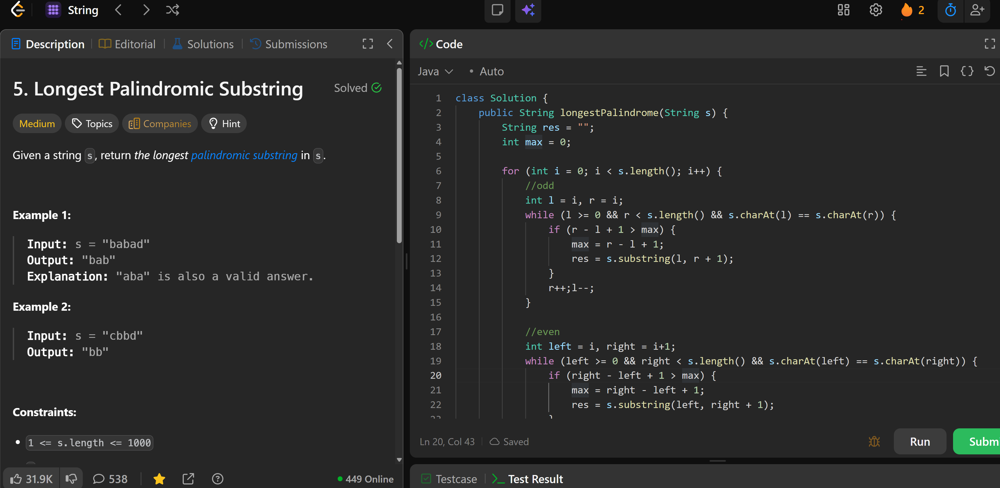

# 5. Longest Palindromic Substring

**刷题日期**: 2025-11-23

**难度**: Medium

**标签**: String, Dynamic Programming

## 题目截图



## 解题心得

使用中心扩展法，分别处理奇数长度（odd）和偶数长度（even）的回文串。从每个位置向两边扩展，找到最长的回文子串。

## 代码

```java
class Solution {
    public String longestPalindrome(String s) {
        String res = "";
        int max = 0;

        for (int i = 0; i < s.length(); i++) {
            //odd
            int l = i, r = i;
            while (l >= 0 && r < s.length() && s.charAt(l) == s.charAt(r)) {
                if (r - l + 1 > max) {
                    max = r - l + 1;
                    res = s.substring(l, r + 1);
                }
                r++;l--;
            }

            //even
            int left = i, right = i+1;
            while (left >= 0 && right < s.length() && s.charAt(left) == s.charAt(right)) {
                if (right - left + 1 > max) {
                    max = right - left + 1;
                    res = s.substring(left, right + 1);
                }
                right++;left--;
            }
        }
        return res;
    }
}
```

## 复杂度分析

- **时间复杂度**: O(n²) - 外层循环遍历每个字符 O(n)，内层 while 循环最坏情况扩展 O(n) 次
- **空间复杂度**: O(1) - 只使用了常数个变量（不计算返回结果的空间）

---
