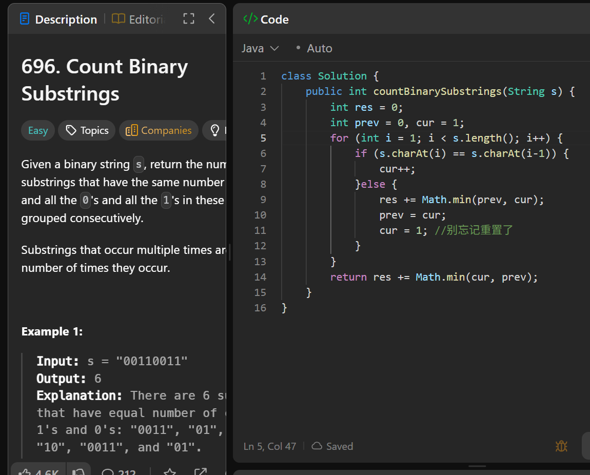

# 696. Count Binary Substrings

**刷题日期**: 2026-02-28

**难度**: Easy

**标签**: String, Two Pointers

## 题目截图



## 解题心得

- 用 prev 和 cur 分别记录前一组和当前组连续相同字符的个数
- 每次遇到不同字符时，res += Math.min(prev, cur)，然后更新 prev = cur，cur 重置为 1
- 别忘记重置 cur = 1
- 最后循环结束后还要再加一次 Math.min(cur, prev)

## 代码

```java
class Solution {
    public int countBinarySubstrings(String s) {
        int res = 0;
        int prev = 0, cur = 1;
        for (int i = 1; i < s.length(); i++) {
            if (s.charAt(i) == s.charAt(i-1)) {
                cur++;
            }else {
                res += Math.min(prev, cur);
                prev = cur;
                cur = 1; //别忘记重置了
            }
        }
        return res += Math.min(cur, prev);
    }
}
```

## 复杂度分析

- **时间复杂度**: O(n) - 遍历一次字符串
- **空间复杂度**: O(1) - 只使用了常数个变量

---
