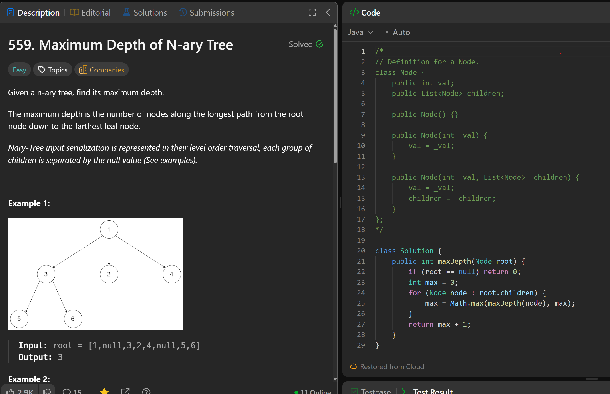

# 559. Maximum Depth of N-ary Tree

**刷题日期**: 2025-11-20

**难度**: Easy

**标签**: Tree, Depth-First Search, Breadth-First Search

## 题目截图



## 代码

```java
class Solution {
    public int maxDepth(Node root) {
        if (root == null) return 0;
        int max = 0;
        for (Node node : root.children) {
            max = Math.max(maxDepth(node), max);
        }
        return max + 1;
    }
}
```

## 复杂度分析

- **时间复杂度**: O(n) - n 是 N 叉树的节点数，每个节点访问一次
- **空间复杂度**: O(h) - h 是树的高度，递归调用栈的深度，最坏情况下为 O(n)

---
