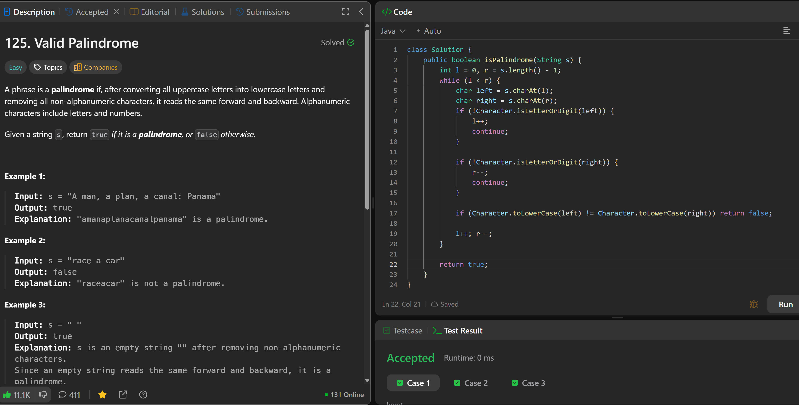

# 125. Valid Palindrome

**刷题日期**: 2025-12-06

**难度**: Easy

**标签**: Two Pointers, String

## 题目截图



## 代码

```java
class Solution {
    public boolean isPalindrome(String s) {
        int l = 0, r = s.length() - 1;
        while (l < r) {
            char left = s.charAt(l);
            char right = s.charAt(r);
            if (!Character.isLetterOrDigit(left)) {
                l++;
                continue;
            }

            if (!Character.isLetterOrDigit(right)) {
                r--;
                continue;
            }

            if (Character.toLowerCase(left) != Character.toLowerCase(right)) return false;

            l++; r--;
        }

        return true;
    }
}
```

## 复杂度分析

- **时间复杂度**: O(n) - 遍历一次字符串
- **空间复杂度**: O(1) - 只使用了常数个变量

---
