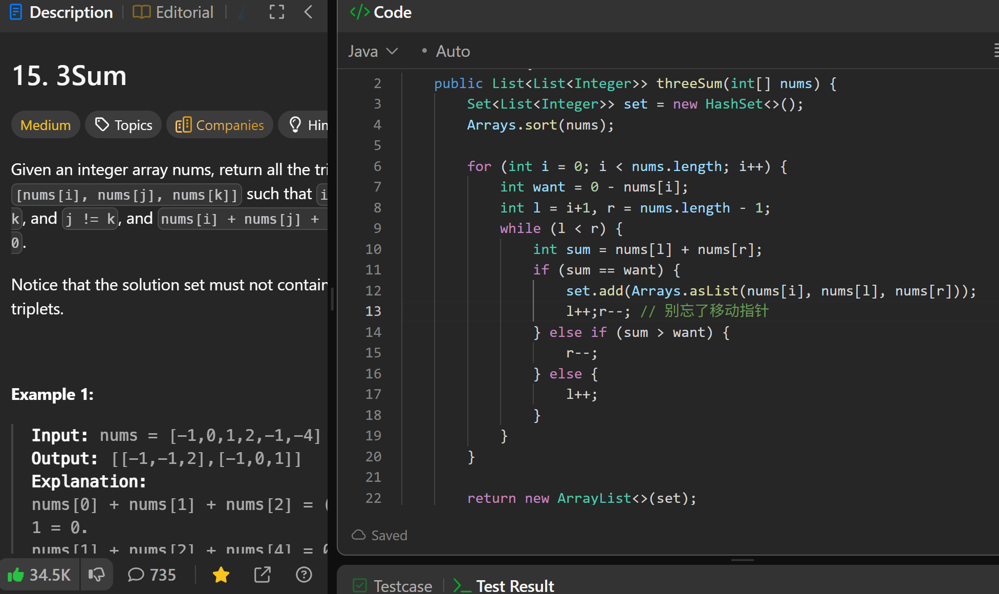

# 15. 3Sum

**刷题日期**: 2025-12-05, 2026-02-21

**复习次数**: 2

**难度**: Medium

**标签**: Array, Two Pointers, Sorting

## 题目截图



## 解题心得

- 先排序，然后固定一个数，用双指针找另外两个数
- 找到匹配后，别忘了移动指针 `l++; r--;`
- 用 HashSet 去重

## 代码

```java
class Solution {
    public List<List<Integer>> threeSum(int[] nums) {
        Set<List<Integer>> set = new HashSet<>();
        Arrays.sort(nums);

        for (int i = 0; i < nums.length; i++) {
            int want = 0 - nums[i];
            int l = i+1, r = nums.length - 1;
            while (l < r) {
                int sum = nums[l] + nums[r];
                if (sum == want) {
                    set.add(Arrays.asList(nums[i], nums[l], nums[r]));
                    l++;r--; // 别忘了移动指针
                } else if (sum > want) {
                    r--;
                } else {
                    l++;
                }
            }
        }
        return new ArrayList<>(set);
    }
}
```

## 复杂度分析

- **时间复杂度**: O(n²) - 排序 O(n log n)，外层循环 O(n)，内层双指针 O(n)
- **空间复杂度**: O(n) - HashSet 存储结果

---
